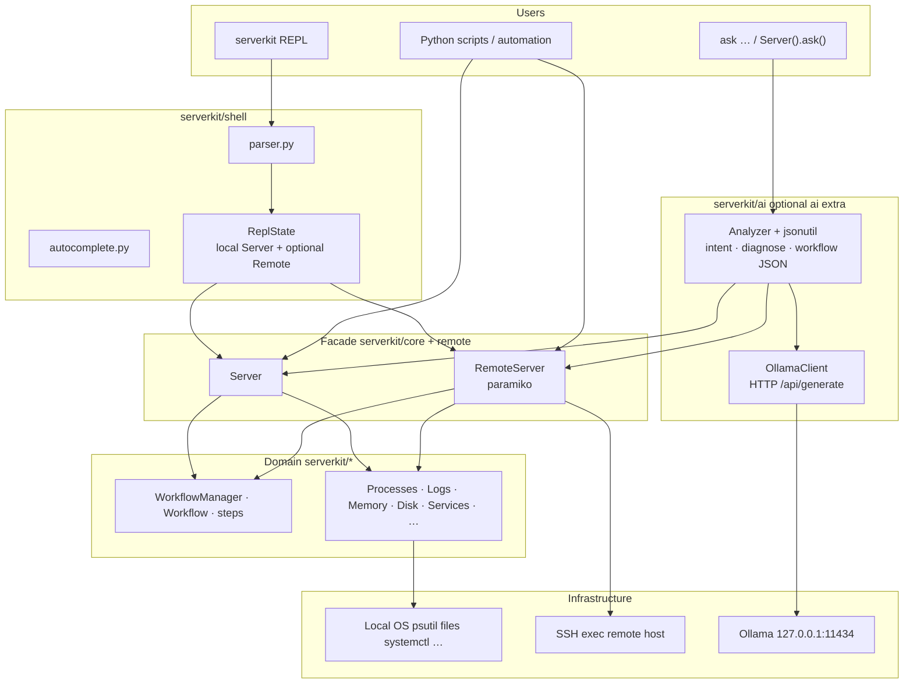

# ServerKit

**Version 0.3.0** · Python **3.10+**

Object-oriented SDK and tooling for **Linux-style server operations** — processes, logs, memory, disk, services, workflows, and more — with a **fluent, chainable API** and an optional **interactive shell** plus **local AI** (Ollama).

Think **typed objects and workflows** instead of re-learning `ps` flags and one-off `grep` pipelines.

**→ Full guide (how it works + how to use):** [`docs/USER_GUIDE.md`](docs/USER_GUIDE.md)

---

## Current project state (v0.3.0)

| Capability | Status |
|------------|--------|
| **`Server` facade** — processes, logs, memory, disk, network, ports, systemd, cron, users, env, Docker | Shipped |
| **Workflow engine** — JSON `schema_version: 2`, catalog `import_workflow`, `run`, fluent `WorkflowBuilder` | Shipped |
| **`Server.connect` → `RemoteServer`** (SSH subset for workflows / processes / logs / memory / services) | Shipped (`[remote]`) |
| **Interactive REPL** — `serverkit` CLI, parser, completions, `connect` / `disconnect`, fluent chains (logs/processes/docker/systemd/…), remote parity for host metrics over SSH | Shipped — see [`docs/USER_GUIDE.md`](docs/USER_GUIDE.md) §5.0 and [`docs/REPL_VERIFICATION.md`](docs/REPL_VERIFICATION.md) |
| **AI layer** — `OllamaClient`, `Analyzer`, `Server.ask()`, REPL `ask …`, defensive JSON + deterministic CPU/memory shortcuts | Shipped (`[ai]`) |
| **Tests** — unit tests for shell parser, AI, workflows; integration marker for live OS | Shipped |

Stable shell/AI integration rules: [`docs/DEV2_CONTRACTS.md`](docs/DEV2_CONTRACTS.md).

---

## Architecture

High-level data flow: **users** → **shell or AI** → **`Server` / `RemoteServer`** → **domain managers** → **OS, SSH, or Ollama**.



Optional extras: **`[rich]`** tables, **`[docker]`**, **`[remote]`** (SSH), **`[ai]`** (HTTP client for Ollama), **`[all]`**.

---

## Features at a glance

- **Fluent collections** — e.g. `server.processes().memory_above(500).sort_by_memory().summarize()`
- **Workflows** — save under `~/.serverkit/workflows/`, run with `server.run("name")`, import from bundled catalog
- **REPL** — `serverkit` for quick commands, remote session via `connect` / `disconnect`
- **AI** — natural language routed through the SDK (no raw shell execution from the model); common **CPU/memory “above N”** phrases use a **regex path** so small models cannot break JSON for those cases

---

## Installation

```bash
python -m venv .venv
.venv\Scripts\activate          # Windows
# source .venv/bin/activate     # Linux / macOS

pip install -e ".[dev]"         # editable + pytest + requests for AI tests
pip install -e ".[rich]"        # Rich tables
pip install -e ".[docker]"      # Docker integration
pip install -e ".[remote]"      # SSH RemoteServer
pip install -e ".[ai]"          # Ollama / natural-language (requests)
pip install -e ".[all]"         # all extras
```

**Console entry point:** `serverkit` → interactive shell.

**Config:** `~/.serverkit/config.json` — output (Rich, progress), workflow executor, remote defaults, `ollama.model`, etc.

---

## Quick start

### SDK

```python
from serverkit import Server

server = Server()

server.processes().memory_above(500).sort_by_memory().all()
print(server.processes().display_by_name())
server.logs("app.log").errors().match(r"timeout").all()
server.memory().summarize()

server.import_workflow("memory_audit")
server.run("memory_audit")

server.workflow("audit").processes().memory_above(1000).summarize().save()
server.run("audit", dry_run=True)
```

### Remote (optional)

```python
from serverkit import Server

with Server.connect("vm1.example", user="deploy", key_path="~/.ssh/id_ed25519") as remote:
    print(remote.processes().memory_above(200).summarize())
    print(remote.memory().summarize())
    remote.service("nginx").status()
    remote.run("memory_audit")
```

### REPL + AI

```bash
serverkit
```

```text
help
memory
processes.all()
catalog
import memory_audit
connect HOST --user USER --key PATH
ask list processes with cpu above 10 percent
disconnect
exit
```

From Python (requires `[ai]` and Ollama running):

```python
from serverkit import Server
print(Server().ask("show processes using more than 200 MB RAM"))
```

See [`docs/AI_TESTING.md`](docs/AI_TESTING.md) for verification, tests, and troubleshooting (including Windows **`WinError 32`** when reinstalling while `serverkit` is open).

---

## Repository layout

```text
opscript/
├── pyproject.toml          # package metadata, extras, serverkit console_script
├── README.md
├── docs/
│   ├── DEV2_CONTRACTS.md   # stable Dev 2 shell + AI contracts
│   ├── AI_TESTING.md       # AI install, tests, manual checks
│   └── *.pdf               # architecture / Dev1 / Dev2 specs
├── examples/               # sample scripts
├── tests/
│   ├── shell/              # REPL parser / completer tests
│   └── ai/                 # Ollama client, Analyzer, jsonutil tests
└── serverkit/
    ├── __init__.py
    ├── core/               # Server facade, collections, protocol
    ├── shell/              # REPL, parser, autocomplete, ReplState
    ├── ai/                 # OllamaClient, Analyzer, jsonutil
    ├── remote/             # SSH RemoteServer (optional)
    ├── workflows/          # engine, builder, catalog JSON, executors
    ├── processes/, logs/, memory/, disk/, services/, …
    └── config.py
```

---

## Development

```bash
pip install -e ".[dev]"
pytest                          # default: excludes integration
pytest -m integration           # live OS / psutil (where applicable)
```

---

## Design rules

| Rule | Detail |
|------|--------|
| Eager execution | Filters apply immediately; `.all()`, `.summarize()`, `.display()` are terminal. |
| Workflows | `schema_version: 2` JSON under `~/.serverkit/workflows/`. |
| Optional deps | Missing `[rich]`, `[docker]`, `[remote]`, `[ai]` → `OptionalDependencyError` with install hint. |

---

## OOP patterns

| Pattern | Where |
|---------|--------|
| Facade | `Server`, `RemoteServer` |
| Factory | `ProcessFactory`, `StepFactory` |
| Fluent collection | `ProcessCollection`, `LogFile`, `DiskCollection`, … |
| Composite | `Workflow` + `WorkflowStep` |
| Strategy | `SequentialExecutor` / `ParallelExecutor` |
| Builder | `WorkflowBuilder` |

---

## Documentation

| Document | Description |
|----------|-------------|
| [`docs/REPL_VERIFICATION.md`](docs/REPL_VERIFICATION.md) | Copy-paste **local + remote** REPL checks after changes |
| [`docs/DEV2_CONTRACTS.md`](docs/DEV2_CONTRACTS.md) | Stable integration API for shell + AI |
| [`docs/AI_TESTING.md`](docs/AI_TESTING.md) | AI extras, automated tests, manual Ollama checks |
| `docs/serverkit_main.pdf` | Full architecture (PDF) |
| `docs/serverkit_dev1_sdk_core.pdf` | Dev 1 SDK spec (PDF) |
| `docs/serverkit_dev2_shell_ai.pdf` | Dev 2 shell + AI spec (PDF) |

---

## License

MIT (see `pyproject.toml`).
